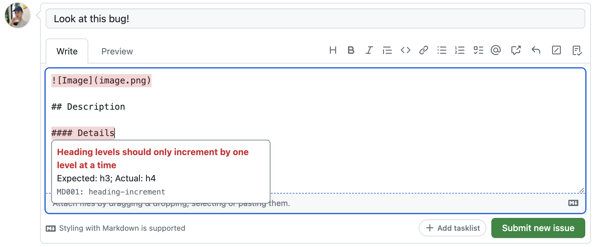

##  Markdown Accessibility Checker

Markdown Accessibility Checker is a browser extension for validating Markdown in GitHub text editors. It encourages writing accessible valid Markdown when creating issues, pull requests, discussions, and comments.



### Installation

Install from your browser's addons store:

- [Chrome or Edge](https://chrome.google.com/webstore/detail/accessibility-checker-for/hdonjoppcjfaojggdiliigclajklepdg)
- [Firefox](https://addons.mozilla.org/en-US/firefox/addon/a11y-checker-github-md/)

### Linting rules

Under the hood, the extension is a wrapper around [Markdownlint](https://github.com/markdownlint/markdownlint), providing a web-compatible UI for viewing linting errors. The base set of rules comes from [Markdownlint-github](https://github.com/github/markdownlint-github). In addition, a few more rules are enabled:

- `heading-increment`: Enforces well-structured headings without skipping levels
- `no-reversed-links`: Enforces valid link syntax (errors if you accidentally flip the square brackets and parentheses)
- `no-empty-links`: Ensures all links have some visible link text

For now, the set of linting rules is not configurable. In order to minimize friction and distractions, only a small subset of lint rules are enabled. The extension does not try to encourage any sort of style or formatting - it's only here to help you with accessibility and syntax.

**Important:** Requests for new rules and changes to existing rules should be made in either the Markdownlint or Markdownlint-github repositories, not here.

### Build Instructions

Building this extension requires [Node and npm](https://nodejs.org/en).

First, install dependencies:

```sh
npm install
```

Build the distributed JS code into `dist/content-script.js`:

```sh
npm run build
```

At this point, you can run the extension in [Firefox](https://developer.mozilla.org/en-US/docs/Mozilla/Add-ons/WebExtensions/Your_first_WebExtension#installing) or [Chrome](https://developer.chrome.com/docs/extensions/mv3/getstarted/development-basics/#load-unpacked) as an 'unpacked' extension.

To check the code for issues, run all the checks:

```sh
npm run check
```

To prepare for publishing, package the built code into `dist/extension.zip`:

```sh
npm run package
```
